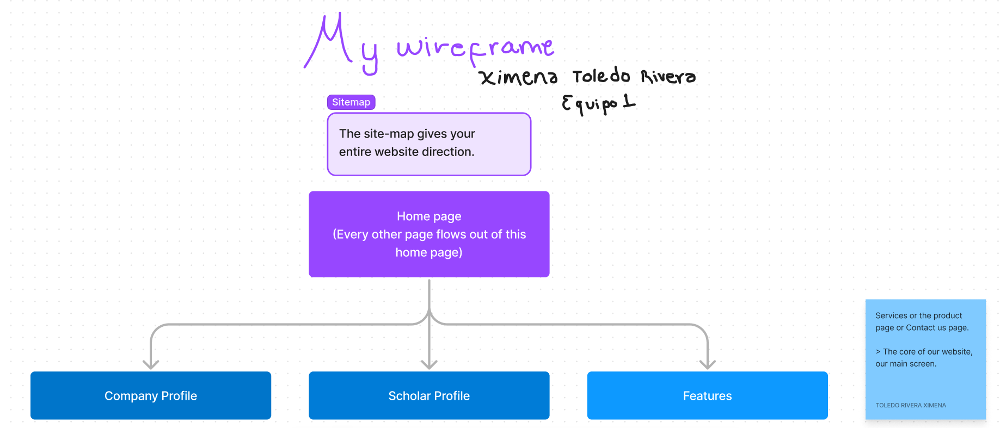
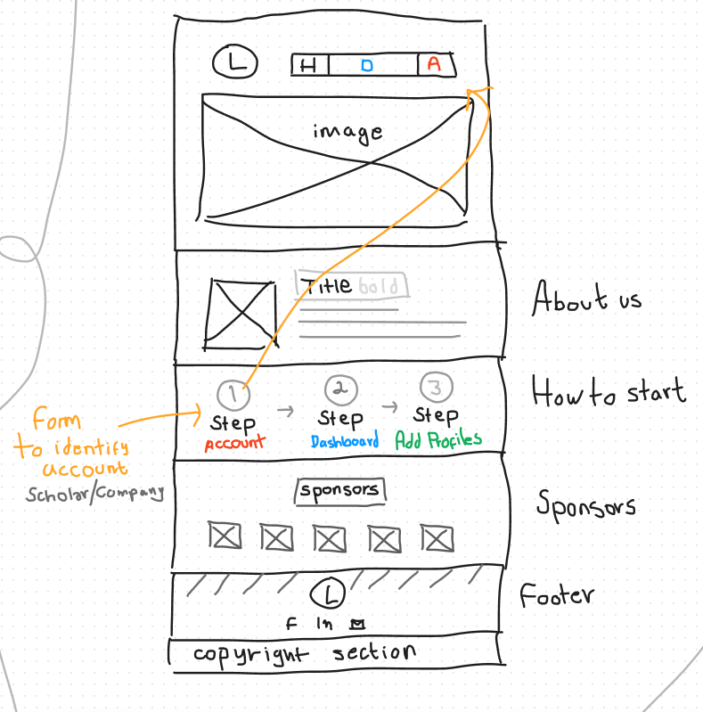
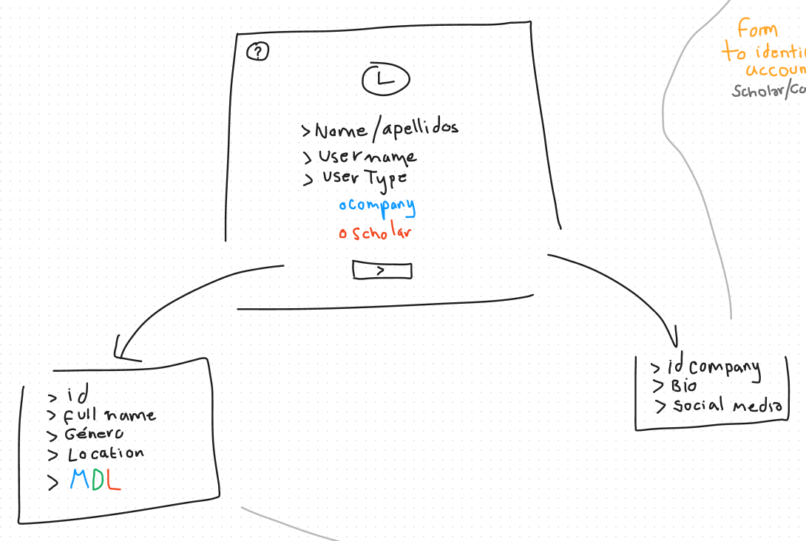
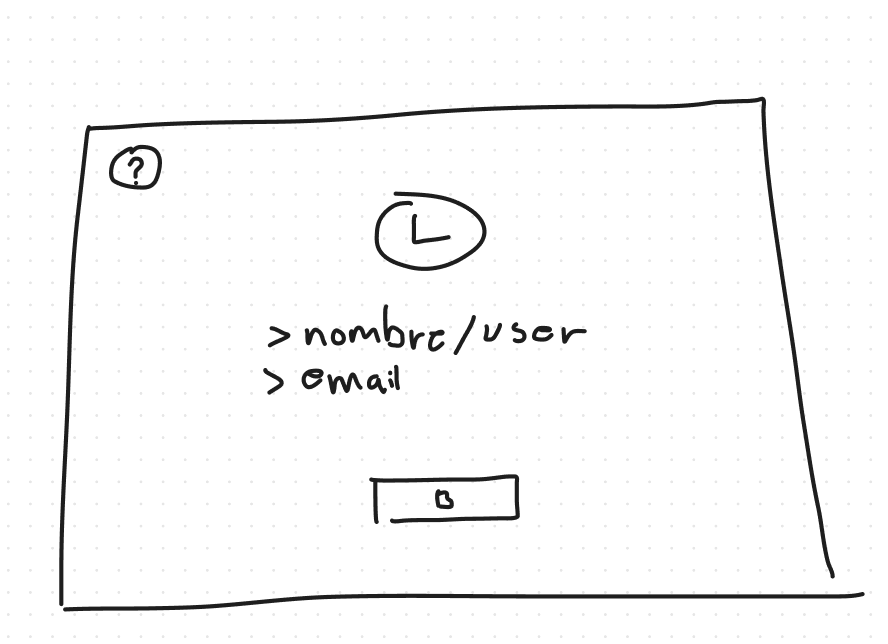
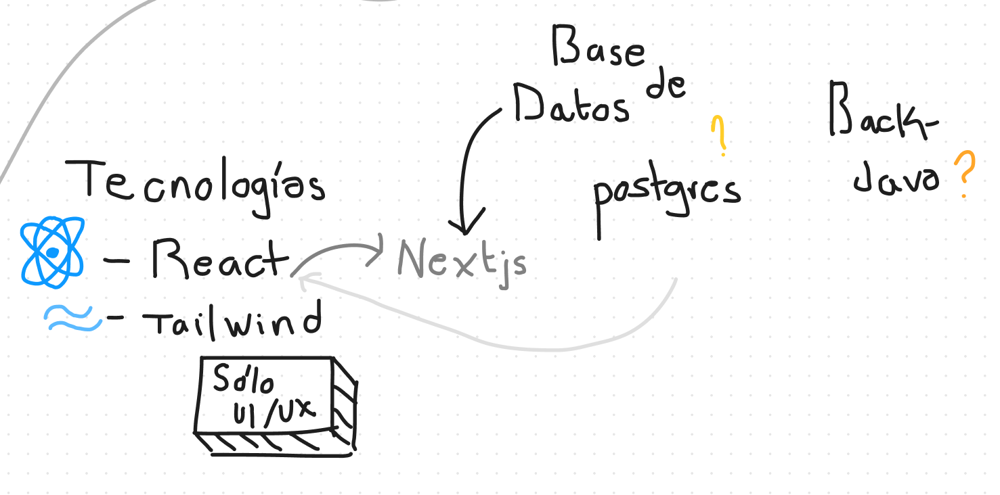
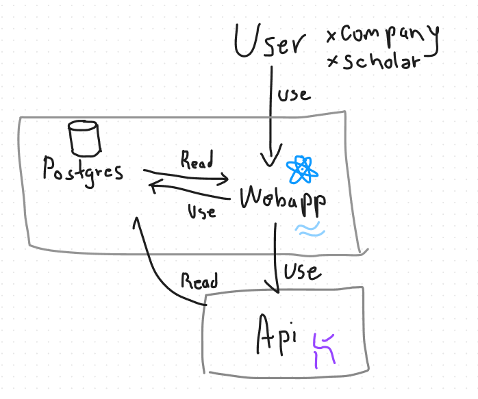

# Diseño de la WebaApp

> Elaborado por Ximena Toledo
> | Equipo-1
> | Hackathon BC |

## Identificar Sitemap

## Diseño de Homepage

## Diseño de perfiles
En esta parte contamos con una diferencia,
1. Existe un perfil con los becarios y esta página cuenta con:
  * Página de cuenta
  * Título de página
  * Apartado de foto de usuario
  * El nombre completo de usuario
  * Descripción general del usuario
  * Redes sociales
  * Apartado de nombre de usuario
  * Apartado del tipo de beca (Doctorado, Maestría y licenciatura)
  * Apartado de estado de beca
  * Compañía asociada al usuario

2. Existe un perfil de las instituciones que brindan las becas:
  * Página de dashboard
  * Título de página
  * Apartado de imagen/logo de la institución
  * El nombre de la compañía/institución
  * Descripción general del usuario
  * Redes sociales de la institución
  * Apartado de seguimiento de becas
    * Nombres de usuarios
    * Tipos de becas de cada usuario
    * Sus estado de becas

## Registro de cuenta
Primero se requiere un correo y un nombre de usuario.
A continuación se identificará el tipo de usuario a partir de una selección que hará el propio usuario.
Se pedirá distinta información dependiendo del tipo de usuario seleccionado y se le redireccionará a su página correspondiente.

## Registro para usuarios con cuenta
> Es importante denotar que la página sólo hará seguimiento de los becarios.

## Tecnologías a utilizar 
Como desarrollador Frontend ocuparé React y Tailwind.

## Diagrama de componentes

